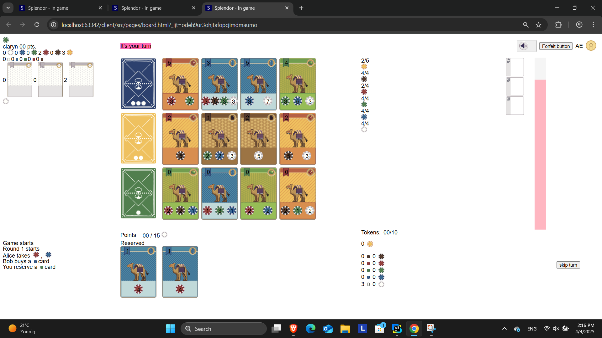
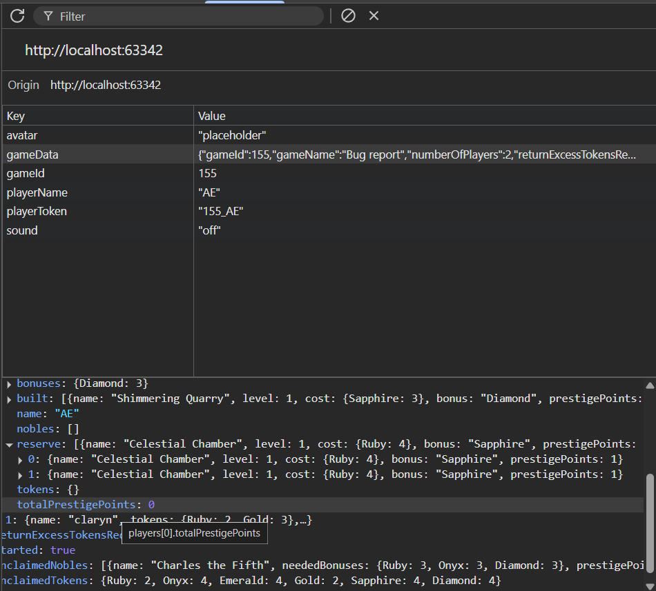

At this moment there is a server-side bug allowing a player to reserve the same card twice. Because of this the player can also buy said card multiple times.

## Bug behaviour

When reserving a card it gets deleted from the game data is it should be. However if you allow the user to reserve this card again it does not throw an error. Doing this does not award additional golden tokens but when buying these you do get extra bonuses and points.

## How to reproduce

After reserving a card you can reproduce this bug 2 ways. This is either possible when the user is able to click a reserve button after selecting a reserved card. This can happen when the user forces this or if there is a client-side bug. A second way you can reproduce this is by sending the reserve request again using a tool like Postman.

